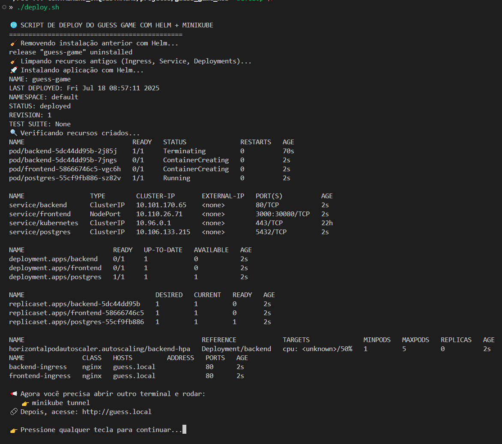
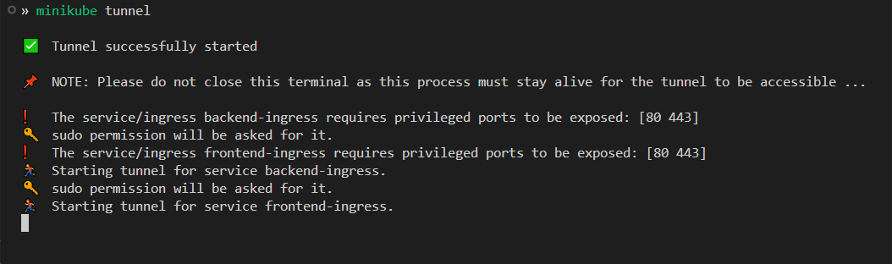
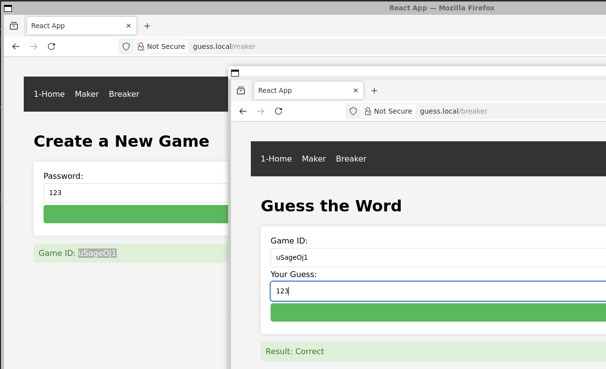

# 🎮 Guess Game – Trabalho prático Unidade 2 Kubernetes 

Este projeto é uma aplicação web simples composta por um backend em Flask e um frontend em React, empacotada em containers Docker e orquestrada com Kubernetes usando Helm.

A proposta é demonstrar uma arquitetura completa, com separação de responsabilidades, autoscaling via HPA, balanceamento com NGINX Ingress Controller, e deploy local com Minikube.

## 🛠️ Tecnologias Utilizadas

- **Kubernetes**: Orquestração dos containers em ambiente local com Minikube.
- **Minikube**: Cluster Kubernetes local usado para testes e validação.
- **Helm**: Gerenciamento do deploy com templates reutilizáveis e `values.yaml`.
- **Ingress (Kubernetes)**: Recurso responsável por expor os serviços HTTP internamente via rotas.
- **Docker Hub**: Armazenamento e fornecimento das imagens públicas usadas no projeto (`guess-backend` e `guess-frontend`).
- **NGINX Ingress Controller**: Roteamento de requisições e balanceamento entre os serviços.
- **HPA (Horizontal Pod Autoscaler)**: Escalonamento automático dos pods com base no uso de CPU.

> As imagens utilizadas neste projeto foram previamente construídas a partir de um backend em Flask e um frontend em React. A fase de desenvolvimento, configuração do Docker Compose e criação das imagens foi realizada no repositório [Guess Game Max](https://github.com/maxmelodia/guess_game_max), sendo este repositório atual focado exclusivamente na orquestração com Kubernetes.

## 📁 Estrutura do Projeto

A estrutura do repositório está organizada da seguinte forma:

```bash
guess_game_k8s/
└── k8s/
    └── guess-game-chart/
        ├── Chart.yaml   # Metadados do chart Helm
        ├── values.yaml  # Parâmetros personalizáveis (imagens, políticas, etc.)
        ├── .helmignore  # Arquivos/pastas ignorados no pacote Helm
        └── templates/   # Recursos Kubernetes modelados como templates Helm
            ├── backend-deployment.yaml
            ├── backend-service.yaml
            ├── frontend-deployment.yaml
            ├── frontend-service.yaml
            ├── postgres-deployment.yaml
            ├── postgres-service.yaml
            ├── hpa-backend.yaml
            ├── ingress-backend.yaml
            └── ingress-frontend.yaml
    ├── images     # imagens para documentação
    ├── deploy.sh  # Script auxiliar para executar a instalação passo a passo
    ├── README.md  # Documentação do projeto
```

> Observação: a orquestração completa é feita por meio do Helm Chart, com recursos como deploys, serviços, ingress e HPA definidos dentro da pasta `templates/`.

## 🔧 Pré-requisitos

Antes de executar este projeto, certifique-se de que os seguintes requisitos estão instalados na sua máquina:

- [Helm](https://helm.sh/) – Para empacotar e instalar os charts no cluster
- [kubectl](https://kubernetes.io/docs/tasks/tools/) – Para interagir com o cluster Kubernetes
- [Minikube](https://minikube.sigs.k8s.io/docs/) – Para simular um cluster Kubernetes local

> 💡 **Você _não_ precisa do Docker instalado**, já que todas as imagens utilizadas estão disponíveis publicamente no Docker Hub:
> - [`maxmelodia/guess-backend:v1`](https://hub.docker.com/r/maxmelodia/guess-backend)
> - [`maxmelodia/guess-frontend:v1`](https://hub.docker.com/r/maxmelodia/guess-frontend)

Você pode verificar as versões instaladas com os comandos:

```bash
helm version
kubectl version --client
minikube version
```

### 🧩 Configuração do arquivo `hosts`

Para acessar a aplicação via domínio personalizado (`http://guess.local`), é necessário adicionar uma entrada no arquivo `hosts` do sistema operacional, apontando esse domínio para o IP de loopback (`127.0.0.1`).

#### 📌 Por que isso é necessário?

O Ingress Controller foi configurado para rotear o tráfego baseado no host `guess.local`. Sem essa entrada, o navegador não consegue resolver esse domínio corretamente, impedindo o acesso à aplicação pela URL definida no Ingress. Essa configuração é comum em ambientes locais com `minikube tunnel` ou redirecionamentos para o host.

#### ✅ Como configurar

1. Edite o arquivo `hosts`:
   - ***Linux/macOS:***
     ```bash
     sudo nano /etc/hosts
     ```
2. Adicione a seguinte linha ao final do arquivo:

    ***127.0.0.1 guess.local***

3. Salve o arquivo

> 💡 Obs.: Essa configuração assume que o Ingress está redirecionando para a porta local corretamente via `minikube tunnel` ou configuração similar.

### 🌐 Utilizando o Firefox (Mozilla) no WSL (EXTRA)

#### 📌 Por que usar o Firefox no WSL?

Ao desenvolver aplicações locais com Minikube + Ingress no WSL2, é comum que as URLs personalizadas (como `http://guess.local`) funcionem melhor em navegadores dentro do próprio ambiente Linux. O Firefox (Mozilla) pode ser executado diretamente no WSL com suporte a GUI, facilitando testes e evitando problemas de rede cruzada entre o WSL e o navegador do Windows.

#### 🧪 Como instalar o Firefox no WSL

1. **Atualize os pacotes:**
```bash
   sudo apt update && sudo apt upgrade
```

2. **Instale o Firefox:**
```bash
sudo apt install firefox -y
```


3. **Execute o Firefox:** Certifique-se de que o WSL tem suporte a interface gráfica (X11 ou WSLg). No WSL2 com Windows 11, basta rodar:
```bash
    firefox
```

>💡 O Firefox abrirá normalmente com interface gráfica se o WSLg estiver habilitado. Nenhuma configuração adicional é necessária no Windows 11.

✅ Vantagens
- Acesso direto às URLs locais (ex: guess.local) sem conflitos de DNS.
- Maior compatibilidade com serviços que rodam 100% dentro do WSL.
- Ideal para testar aplicações em ambientes Linux nativos.

## 🚀 Instalação local com Minikube

Com o Minikube e o Helm instalados e em execução, você pode subir todo o projeto com apenas um comando usando o script `deploy.sh`.

**1. Clone o repositório**

```bash
git clone https://github.com/maxmelodia/guess_game_k8s.git
cd guess_game_k8s
```
**2. Execute o script de deploy**

```bash
chmod +x deploy.sh
./deploy.sh
```
**🖼️ Imagem de exemplo (execução do script de deploy)**



**3. Agora você precisa abrir outro terminal e rodar**

```bash
minikube tunnel
```
**🖼️ Imagem de exemplo (minikube tunel em execução)**



## ✅ Verificando se a aplicação está no ar

Após rodar o script deploy.sh e iniciar o túnel com minikube tunnel, siga os passos abaixo para validar se tudo foi implantado com sucesso:

**1. Acesse a aplicação no navegador**
Abra o nagevador e digite:
```bash
http://guess.local
```
A tela principal do jogo será carregada

**🖼️ Imagem de exemplo (Aplicação rodando em guess.local)**


**2. Verifique os pods**
```bash
kubectl get pods
```
Todos os pods devem estar com o status Running.

**3. Verifique os serviços**
```bash
kubectl get svc
```
Você deve ver as portas expostas, incluindo o LoadBalancer que aponta para guess.local.


## 📈 Teste de Carga com `hey`

Para avaliar o comportamento da aplicação sob carga, foi utilizado o utilitário [`hey`](https://github.com/rakyll/hey), uma ferramenta simples de benchmark HTTP.

Esse teste ajuda a validar o funcionamento do autoscaling (HPA) e a resiliência dos pods durante múltiplas requisições simultâneas.

### 🔧 Instalação do `hey`

Você pode instalar o `hey` localmente via:

```bash
sudo apt install hey
```

### 🔧 Executando o teste

Com a aplicação rodando em http://guess.local, rode o seguinte comando:
```bash
hey -n 1000 -c 50 http://guess.local/api
```

Parâmetros:
-    -n 1000: número total de requisições
-    -c 50: número de requisições simultâneas (concorrência)
-    http://guess.local/api: endpoint de teste da aplicação

### 📊 Exemplo de saída
```bash
Summary:
  Total:        5.2341 secs
  Slowest:      0.1423 secs
  Fastest:      0.0031 secs
  Average:      0.0278 secs
  Requests/sec: 191.11

Status code distribution:
  [200] 1000 responses
```

**🖼️ Imagem de exemplo (Teste de carga com Hey)**


---

## 👨‍💻 Sobre o Desenvolvedor

Este projeto foi desenvolvido por **Maxwell Roberto Duarte** como parte da disciplina de Kubernetes do curso de pós-graduação em DevOps & Continuous Software Engineering - PUC Minas.

- 💼 GitHub: [@maxmelodia](https://github.com/maxmelodia)
- 📫 E-mail: maxmelodia@gmail.com
- 🌐 Matrícula: 229598
---
[](https://github.com/maxmelodia) [](https://github.com/maxmelodia) [](https://www.linkedin.com/in/maxwell-roberto/) [](https://www.youtube.com/user/maxmelodia)